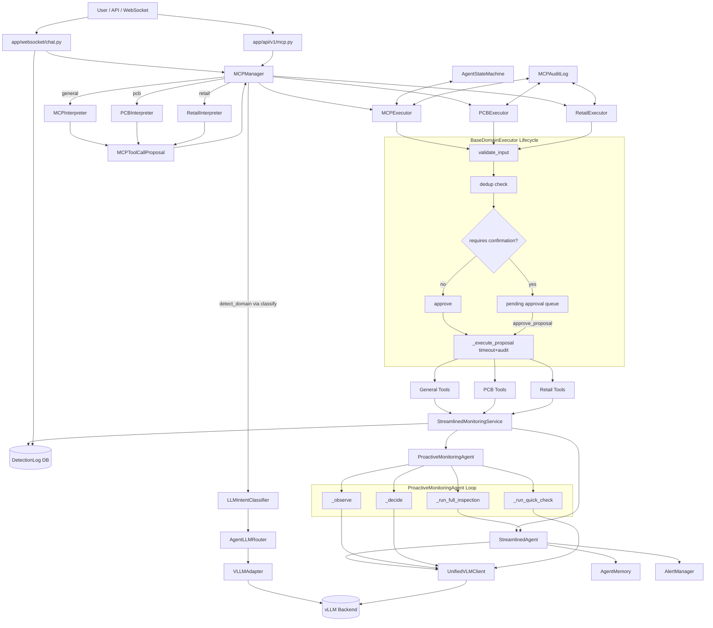

# Agent Implementation Deep Review

## Scope and Sources

This document analyzes the current agent implementation in the following runtime surfaces:

- Core runtime: `agents/core/camera_agent.py`, `agents/core/proactive_agent.py`, `agents/core/state.py`, `agents/core/alerting.py`
- MCP stack: `agents/mcp/manager.py`, `agents/mcp/interpreter.py`, `agents/mcp/executor_base.py`, `agents/mcp/executor.py`, `agents/mcp/domains/{pcb,retail}.py`, `agents/mcp/{registry,lifecycle,state_machine,session,audit,tool_defs,globals}.py`
- Domain tools: `agents/tools/{base,pcb,retail,email,validation}.py`
- LLM/VLM interaction: `agents/classifiers/llm_classifier.py`, `agents/vlm/{client,prompts,task_types}.py`, `router/{llm_router.py,adapters/vllm.py,base.py,config.py}`
- Application entrypoints: `run.py`, `app/__init__.py`, `app/websocket/chat.py`, `app/api/v1/mcp.py`, `services/core/monitoring.py`, `services/infrastructure/vlm.py`

---

## 1) Agent Structure & Control Flow

### 1.1 High-level architecture

The deployed system is **one application with two agentic control planes**:

1. **Reactive monitoring agent plane**
   - `StreamlinedMonitoringService` (orchestrator)
   - `StreamlinedAgent` (frame analysis + event creation + alert handling)
   - `UnifiedVLMClient` (vision-language inference)

2. **MCP conversational/tool-calling plane**
   - `MCPManager` (domain routing + facade)
   - Domain interpreters (`MCPInterpreter`, `PCBInterpreter`, `RetailInterpreter`)
   - Domain executors (`MCPExecutor`, `PCBExecutor`, `RetailExecutor`) via `BaseDomainExecutor`

A third optional layer is the **Proactive agent plane**:
- `ProactiveMonitoringAgent` (continuous observe/decide loop using LLM structured prompts)
- Delegates full inspections to `StreamlinedAgent.analyze_with_prompt`

### 1.2 End-to-end execution lifecycle

#### A) Process initialization

1. `run.py::main()`
   - Loads env (`dotenv`), logging, config, model auto-detection.
   - Initializes DB.
   - Creates Flask app + websocket handlers.
   - Starts Socket.IO server.

2. `app.create_app()`
   - Registers REST API and websocket handlers.

3. MCP globals are lazy; no heavy MCP init until first use.

#### B) Reactive monitoring lifecycle

1. `get_monitoring_service()` creates singleton `StreamlinedMonitoringService` lazily.
2. `start_monitoring()`:
   - Rejects if already monitoring or proactive mode running.
   - Calls `initialize()` if needed.
3. `initialize()`:
   - Loads YAML config.
   - Builds `UnifiedVLMClient` (`services/infrastructure/vlm.py`).
   - Builds `StreamlinedAgent` + `CircuitBreaker`.
   - Starts camera publisher (if configured).
4. `_monitoring_loop()`:
   - Subscribes to camera feed.
   - Pulls frames, throttles by capture interval.
   - Runs `_run_analysis()` (agentic or regular prompt mode).
   - Records detections to DB + websocket stream (`_record_detection`).
5. `stop_monitoring()` joins worker thread.

#### C) Proactive monitoring lifecycle

1. `start_proactive_monitoring(instruction)`:
   - Ensures core agent initialized.
   - Stops reactive loop if running.
   - Creates or updates `ProactiveMonitoringAgent`.
2. `ProactiveMonitoringAgent.start()` spawns thread.
3. `_loop()` repeats:
   - Get frame
   - `_observe()` structured LLM observation
   - `_decide()` structured LLM action choice
   - Execute action (`wait` / `quick_check` / `full_inspection`)
   - For full inspection, call `StreamlinedAgent.analyze_with_prompt`
4. `stop_proactive_monitoring()` stops and unsubscribes.

#### D) MCP conversational lifecycle

1. User message enters via websocket (`app/websocket/chat.py::_process_user_message`) or REST (`/api/v1/mcp.py`).
2. `MCPManager.interpret()`:
   - Determines domain via `detect_domain()` (LLM classifier).
   - Routes to selected interpreter.
   - Interpreter returns `MCPToolCallProposal` or `None`.
3. If proposal exists, `MCPManager.submit()` routes to domain executor.
4. `BaseDomainExecutor.submit_proposal()`:
   - Registry lookup
   - Input schema validation
   - dedup check
   - confirmation policy
   - auto-approve or queue pending
5. On approval (auto or user), `_execute_proposal()` executes `_invoke()` with timeout + audit logging.
6. Tool result propagated to chat/API and optionally updates state/session/context.

### 1.3 State transitions and branching logic

#### Agent operational states (`AgentStateMachine`)

- `OFF`, `IDLE`, `MONITORING`, `ANALYZING`, `ALERTING`, `ERROR`
- Transition matrix enforced in `state_machine.py` (`VALID_STATE_TRANSITIONS`).

Key state transitions in general executor:
- `start_monitoring_session`: `OFF→IDLE→MONITORING` (or to `MONITORING` from valid states)
- `analyze_current_frame`: temporary `*→ANALYZING→old_state|IDLE`
- `go_idle`: any valid state to `IDLE`
- `shutdown_agent`: to `IDLE` then `OFF`
- `acknowledge_error`: `ERROR→IDLE`

Branch points:
- Domain routing confidence threshold in `MCPManager.detect_domain`: classifier confidence must be `>=0.3`; else `general`.
- Proposal confirmation path depends on `tool.requires_confirmation` and `can_auto_approve`.
- Executor dedup path rejects repeated identical tool+args within 5s.
- Monitoring path chooses agentic/non-agentic based on active prompt config.

---

## 2) Methods & Internal Logic

This section enumerates significant methods and their semantics.

## 2.1 `StreamlinedAgent` (`agents/core/camera_agent.py`)

### `__init__(config, vlm_client, circuit_breaker=None)`
- Purpose: initialize runtime dependencies (VLM client, alert manager, memory, SSIM cache, image saving).
- Inputs: config dict, `UnifiedVLMClient`, optional circuit breaker.
- Outputs: instance state.
- Called by: `StreamlinedMonitoringService.initialize()`.
- Side effects:
  - Creates image directory if enabled.
  - Sets internal memory ring buffer and similarity cache.

### `_check_ssim_skip(frame, current_time)`
- Purpose: avoid re-analysis on near-identical scene.
- Logic:
  - If previous frame/event exists and within recheck window, compare similarity via SSIM or template matching.
  - If above threshold, deep-copy previous event, stamp fresh timestamp, force `should_alert=False`, return reused event.
- Called by: `analyze_frame`.
- Side effects: none directly; returns reusable event.

### `_run_vlm_analysis(frame, cv_context, max_retries=2)`
- Purpose: guarded VLM inference with circuit breaker + retries.
- Logic:
  - Calls `circuit_breaker.call(vlm_client.analyze_frame, ...)`.
  - Stops retry immediately if breaker open.
  - Backoff retry for other exceptions.
- Failure modes: returns `None` after max retries.

### `analyze_frame(frame, metadata=None)`
- Purpose: unified frame analysis path (legacy-style detection event).
- Logic:
  1. SSIM skip gate
  2. VLM analysis
  3. Build `DetectionEvent`
  4. Update cache and memory
- Side effects:
  - May persist image file.
  - Updates in-memory event history.

### `analyze_with_prompt(frame, task_type, custom_prompt="", metadata=None)`
- Purpose: prompt-driven single-frame analysis (current primary path in services/tools).
- Logic:
  - Calls `vlm_client.analyze` via circuit breaker.
  - Constructs `DetectionEvent` with classification metadata.
- Called by:
  - `StreamlinedMonitoringService._run_analysis`
  - `ProactiveMonitoringAgent._run_full_inspection`

### `analyze_agentic(frame, task_type=None, custom_prompt=None, recipients=None)`
- Purpose: same VLM analysis but with textual tool-calling layer (`analyze_with_tools`).
- Logic:
  - Builds `ToolExecutor`
  - Calls `UnifiedVLMClient.analyze_with_tools`
  - Translates tool calls/results into event tool trace
- Side effects:
  - Tool executions may send emails / log DB / save files.

### `process_detection(event, image_data=None)`
- Purpose: execute configured rule-based alerts for alertable event.
- Called by: potentially external monitoring flows.
- Side effects: sends email and desktop notifications.

### `apply_config(updated_config)`
- Purpose: hot-apply config to alert manager and memory sizing.

## 2.2 `ProactiveMonitoringAgent` (`agents/core/proactive_agent.py`)

### Lifecycle methods
- `start()`: spawns proactive loop thread.
- `stop()`: stops thread and unsubscribes publisher.
- `update_instruction(instruction)`: runtime objective update.
- `snapshot()` / `get_performance_metrics()`: observability.

### `_loop()`
- Purpose: two-stage LLM control loop.
- Steps:
  1. Subscribe to camera stream
  2. frame gating by interval
  3. `_observe` (structured perception)
  4. `_decide` (action selection)
  5. execute action branch (`wait`, `quick_check`, `full_inspection`)
- Side effects:
  - context mutation every iteration
  - optional callback dispatch with detection event metadata

### `_observe(frame_obj)`
- Purpose: generate structured observation with temporal continuity.
- Inputs:
  - current instruction
  - last observation payload
  - context hints
- Backend: `vlm_client.run_structured_prompt` + `build_proactive_observation_prompt`.
- Output: `ObservationResult` or `None` if parsing fails.
- State mutation: updates scene-change counters and ready-frame counters.

### `_decide(frame_obj, observation)`
- Purpose: choose next action via LLM reasoning.
- Backend: `build_proactive_decision_prompt` + structured call.
- Output: `DecisionResult`.
- Note: no deterministic guardrails; action comes from parsed JSON.

### `_run_quick_check(frame_obj, observation)`
- Purpose: cheap follow-up verification.
- Output: `QuickCheckResult` or `None`.

### `_run_full_inspection(frame_obj, observation, decision)`
- Purpose: perform expensive inspection via `StreamlinedAgent`.
- Logic:
  - resolve plan (`_resolve_plan`) -> currently always `TaskType.CUSTOM`
  - invoke `detection_agent.analyze_with_prompt`
  - enrich event decision trace with proactive context
  - track inspected scene signatures

### Helper methods
- `_register_action`, `_expire_inspections`, `_derive_signature`, `_resolve_plan`.

## 2.3 MCP manager/interpreter/executor stack

### `MCPManager`

- `_ensure_init()`: lazy load PCB and retail domain MCPs.
- `detect_domain(message)`: LLM classifier route decision.
- `route(message, domain=None)`: return `(domain, interpreter, executor, registry)`.
- `interpret(...)`: run interpreter and attach `__domain` tag for downstream submit.
- `submit(proposal, domain=None)`: strip internal tag and execute via correct executor.
- `approve_proposal` / `reject_proposal`: cross-domain proposal resolution.
- `get_pending_proposals(domain=None)`: aggregate pending queue across domains.
- `get_all_tools(...)`: grouped tool discovery.

### `MCPInterpreter` (general)

- `interpret(user_message, agent_state, session_id)`:
  - audit intent event
  - classify via `LLMIntentClassifier`
  - validate tool against allowlist + registry
  - inject default `query` for `analyze_current_frame`
  - create proposal and audit it
- `_finalize_proposal(...)`: writes `TOOL_PROPOSED` audit event.

### `BaseDomainExecutor`

- `submit_proposal(proposal)`:
  - registry lookup
  - argument schema validation
  - dedup check (`_is_duplicate`)
  - confirmation gating (queue pending vs auto-approve)
  - execute approved proposal
- `_execute_proposal(proposal, tool)`:
  - set executing state
  - run `_invoke` in thread pool with timeout
  - normalize success/failure responses
  - audit all execution phases
- `approve_proposal`, `reject_proposal`, `get_pending_proposals`: pending lifecycle.

### `MCPExecutor` (general domain handlers)

Significant handlers and dependencies:
- `_handle_start_monitoring_session`: creates `MCPSession`, transitions state, starts monitoring service.
- `_handle_end_session`: stops monitoring, ends session, transitions to idle.
- `_handle_get_agent_status`: merges state machine + service stats + audit metrics.
- `_handle_analyze_frame`: transitions to `ANALYZING`, calls `service.analyze_single_frame`, stores `last_frame_analysis` context.
- `_handle_set_detection_task`: configures monitoring service task/prompt and enables agentic mode.
- `_handle_send_alert_email`, `_handle_save_evidence`, `_handle_log_event`, `_handle_query_history`: dispatch to `agents.tools.base` handlers.

### Domain interpreters/executors

#### `PCBInterpreter`
- Uses classifier result, requires `domain==pcb` and tool in PCB allowlist.
- Filters params by `_TOOL_PARAM_ALLOWLIST`.
- Synthesizes default `query` / `defect_summary` when missing.

#### `PCBExecutor`
- `_invoke` dispatches to `agents.tools.pcb` handlers.
- Filters arguments by per-tool allowlist.

#### `RetailInterpreter`
- Same shape as PCB with retail tool allowlist.
- Defaults `scan_tray_items.query` to user message.

#### `RetailExecutor`
- Maintains session-scoped pipeline state (`scan_result`, `bill`, `invoice_id`).
- `_invoke` orchestrates automatic flow composition:
  - create bill can auto-scan
  - generate invoice can auto-scan then auto-bill
  - send email auto-injects bill/invoice context

## 2.4 LLM/VLM client methods

### `LLMIntentClassifier`

- `classify(message)`:
  - circuit-breaker precheck
  - `_call_llm`
  - fallback to low-confidence general on errors
- `_call_llm(message)`:
  - builds long classification prompt
  - uses router first (`_router_completion`) then direct vLLM fallback (`_vllm_completion`)
  - parses first JSON object from model output
- `_parse_response(text)`:
  - strips markdown/thinking wrappers
  - brace-balanced JSON extraction
- Circuit methods:
  - `_is_circuit_open`, `_record_success`, `_record_failure`

### `UnifiedVLMClient`

- Prompt and transport:
  - `_build_prompt` (currently always custom-query template)
  - `_send_vllm_request` / `_send_ollama_request`
  - `run_structured_prompt`
- Analysis:
  - `analyze` -> returns `AnalysisResult`
  - `analyze_frame` -> legacy `DetectionResult`
- Agentic:
  - `analyze_with_tools`
  - `_get_tools_prompt`
  - `_parse_tool_calls`
- Parsing and image preprocessing:
  - `_encode_frame`, `_resize_for_inference`, `_parse_json_response`

## 2.5 Domain tool handlers

### PCB tools (`agents/tools/pcb.py`)
- `tool_inspect_pcb` → `MonitoringService.analyze_single_frame` with PCB defect prompt.
- `tool_classify_board` → VLM frame analysis + `services.domains.pcb.service.classify_board_from_analysis`.
- `tool_send_defect_alert` → validates recipients, calls `agents.tools.email.send_email`.
- `tool_log_defect` → delegates to `services.domains.pcb.service.record_defect`.
- `tool_generate_defect_report` → delegates to `services.domains.pcb.service.generate_defect_report`.

### Retail tools (`agents/tools/retail.py`)
- `tool_scan_tray_items` → frame scan prompt + multiple fallback JSON extractors.
- `tool_lookup_item_price` → `services.domains.retail.service` lookups.
- `tool_create_bill` → `services.domains.retail.bill_service` assembly.
- `tool_generate_invoice` → save invoice + render HTML/PDF + update DB + TTS playback.
- `tool_send_invoice_email` → save/send or resend invoice via service layer.

---

## 3) Tools & MCP Integration

## 3.1 MCPs in this system

1. **General MCP**
   - Interpreter: `MCPInterpreter`
   - Executor: `MCPExecutor`
   - Registry: `GeneralToolRegistry`

2. **PCB MCP**
   - Interpreter: `PCBInterpreter`
   - Executor: `PCBExecutor`
   - Registry: `PCBToolRegistry`

3. **Retail MCP**
   - Interpreter: `RetailInterpreter`
   - Executor: `RetailExecutor`
   - Registry: `RetailToolRegistry`

`MCPManager` is the domain router/facade over all MCPs.

## 3.2 Tool inventory and call mapping

### General-domain tools (`agents/mcp/tool_defs.py`)

- `start_monitoring_session` -> `MCPExecutor._handle_start_monitoring_session`
- `end_session` -> `MCPExecutor._handle_end_session`
- `get_session_summary` -> `MCPExecutor._handle_get_session_summary`
- `get_agent_status` -> `MCPExecutor._handle_get_agent_status`
- `analyze_current_frame` -> `MCPExecutor._handle_analyze_frame`
- `go_idle` -> `MCPExecutor._handle_go_idle`
- `shutdown_agent` -> `MCPExecutor._handle_shutdown_agent`
- `acknowledge_error` -> `MCPExecutor._handle_acknowledge_error`
- `send_alert_email` -> `MCPExecutor._handle_send_alert_email` -> `agents.tools.base._tool_send_alert_email`
- `save_evidence` -> `_tool_save_evidence`
- `log_event` -> `_tool_log_event`
- `query_history` -> `_tool_query_history`
- `set_detection_task` -> `MCPExecutor._handle_set_detection_task`

### PCB-domain tools

- `inspect_pcb` -> `tool_inspect_pcb`
- `classify_board` -> `tool_classify_board`
- `send_defect_alert` -> `tool_send_defect_alert`
- `log_defect` -> `tool_log_defect`
- `generate_defect_report` -> `tool_generate_defect_report`

### Retail-domain tools

- `scan_tray_items` -> `tool_scan_tray_items`
- `lookup_item_price` -> `tool_lookup_item_price`
- `create_bill` -> `tool_create_bill`
- `generate_invoice` -> `tool_generate_invoice`
- `send_invoice_email` -> `tool_send_invoice_email`

## 3.3 Invocation conditions, parameters, and expected outputs

Common proposal path:
1. Interpreter creates `MCPToolCallProposal` with `tool_name`, `arguments`, `confidence`.
2. Executor validates against `MCPParameterSchema`.
3. If confirmation required, status is `pending_approval`.
4. Else execution runs and returns `{"status":"executed","result":...}`.

Expected tool response contract in handlers is mostly:
- `{"success": bool, "message": str, "data"?: {...}}`

## 3.4 Error handling / retries / fallback

### Interpreter layer
- On classifier failure, general interpreter returns `None`.
- Domain interpreters currently rely on classifier call without local `try/except`; exception propagates.

### Executor layer
- Input validation rejection.
- Dedup rejection within 5 seconds.
- Timeout protection in `_execute_proposal` (default 60s).
- Internal execution errors return generic `"An internal error occurred"` outward.

### LLM / router layer
- Router/vLLM adapter retries with exponential backoff and concurrency limiter.
- Classifier has separate small circuit breaker and falls back to low-confidence `general`.
- VLM analysis may fallback to synthetic low-confidence parse result if JSON parse fails.

---

## 4) LLM Backend Interaction

## 4.1 Channels used

1. **Intent classification LLM**
   - `LLMIntentClassifier`
   - prompt: `_CLASSIFICATION_PROMPT + user_message`
   - expected strict JSON

2. **Vision-language analysis LLM**
   - `UnifiedVLMClient`
   - prompt template: `CUSTOM_QUERY_TEMPLATE`
   - image sent as base64 `image_url` in OpenAI-format message

3. **Proactive control LLM**
   - Uses `run_structured_prompt` with:
     - `build_proactive_observation_prompt`
     - `build_proactive_decision_prompt`
     - `build_quick_check_prompt`

4. **Conversational chat response LLM**
   - `app/websocket/chat.py::_generate_llm_response`
   - router chat with system prompt + recent history

## 4.2 Prompt construction and context assembly

- Classification prompt embeds domain definitions, tool catalogs, extraction rules, and response schema.
- VLM custom prompt is user instruction wrapped in JSON-output contract.
- Proactive prompts embed rolling context snapshots and prior observation/decision state.

## 4.3 Response parsing and control impact

- Parser strategy: strip wrappers (markdown, `<think>`, template tokens), locate first balanced JSON object, parse.
- Parsed fields directly drive:
  - domain/tool selection
  - action selection (`wait/quick_check/full_inspection`)
  - alert and event creation (`detected`, `should_alert`, confidence)

## 4.4 Safeguards and constraints

- Classifier circuit breaker opens after consecutive failures.
- Router adapter has retry/backoff/concurrency control.
- MCP tools validate schema before execution.
- Confirmation-required tools gate risky operations (e.g., emails, shutdown).

## 4.5 Known limitations

- Strong dependence on strict JSON adherence from model.
- No formal schema validator over parsed model JSON (best-effort coercion only).
- Some flow-control fields are generated but not enforced downstream (`should_emit_event` not consulted).

---

## 5) Behavioral Analysis

## 5.1 Normal operation behavior

- Chat/API requests become MCP proposals and execute through policy gates.
- Monitoring loop repeatedly samples latest camera frame, runs prompt-based analysis, emits detection logs.
- Retail domain exhibits opportunistic auto-pipeline (scan→bill→invoice) when upstream context missing.

## 5.2 Edge-case behavior

- Empty / conversational messages may return no proposal and get conversational response.
- No frame availability causes tool failure messages (service-level `last_error`).
- Non-JSON model output triggers fallback parser paths and/or fallback analysis results.

## 5.3 Failure scenarios

- LLM unreachable:
  - classifier falls to `general` with low confidence.
  - analysis requests raise request exceptions unless caller catches.
- Tool timeout:
  - executor returns failed status; proposal marked failed in lifecycle.
- Duplicate request burst:
  - dedup rejects repeated tool calls within 5 seconds.

## 5.4 Implicit assumptions and emergent behavior

Assumptions:
- LLM emits usable JSON frequently.
- Domain classification confidence threshold of 0.3 is broadly safe.
- Fallback textual extraction in retail scan is “better than empty” even with false positives.

Emergent behavior:
- Retail auto-pipeline can execute more operations than explicitly requested when missing intermediate state.
- Chat experience may appear highly autonomous because many tools auto-approve.

---

## 6) Architecture Diagram

---

## 7) Critical Review

## 7.1 Potential flaws / bottlenecks

1. **Metric mismatch in memory reuse counting**
   - `AgentMemory._calc_counts()` counts reused decisions when source is `agent_ssim_guard`.
   - `StreamlinedAgent._remember_event` records source `ssim_skip` for skip path.
   - Result: reused counter likely under-reported.

2. **Unused/partially-used orchestration fields**
   - Proactive `DecisionResult.should_emit_event` is produced but not respected before callback emission.
   - Monitoring service has async-analysis executor queue fields but loop mostly executes inline.

3. **Classifier robustness gap in domain interpreters**
   - General interpreter catches classifier failures, but PCB/Retail interpreters directly call classifier without local fallback.

4. **Dedup granularity may reject legitimate quick repeats**
   - Dedup window is global per executor and signature-only on tool+args; no user/session nuance.

5. **Tight coupling between executors and service singletons**
   - Handlers directly import global service factories (`get_monitoring_service`) and global executors.
   - Makes unit testing and multi-instance operation harder.

6. **Observability fragmentation**
   - State transitions tracked in `AgentStateMachine`, proposal execution in `MCPAuditLog`; no unified correlation id across all paths.

7. **Broad exception masking in tool handlers**
   - `safe_error` hides root causes from caller, making debugging difficult in non-prod contexts.

## 7.2 Refactoring opportunities

1. **Introduce typed execution context object**
   - Replace ad-hoc dict contexts (`executor.context`, pipeline state dicts) with typed dataclasses.

2. **Unify interpreter fallback semantics**
   - Standardize behavior across general/pcb/retail interpreters for classifier failures.

3. **Schema-first model output validation**
   - Validate parsed LLM JSON with strict schemas before decision/state mutation.

4. **Decompose retail auto-pipeline**
   - Move orchestration to explicit workflow service with transparent steps and idempotency keys.

5. **Improve correlation and tracing**
   - Propagate request/proposal/session ids into monitoring analysis logs and DB records.

6. **Formalize state+event policy layer**
   - Explicitly enforce fields like `should_emit_event` and action safety constraints.

## 7.3 Reliability improvements (concrete)

- Add per-domain interpreter resilience wrapper with fallback (`general` or `None`) and telemetry.
- Add guardrail timeouts around service-layer tools that may block (PDF generation, email, TTS).
- Add bounded retries for VLM structured prompt calls in proactive loop with jittered sleep.
- Add circuit breaker stats surface in `/mcp/state` payload for operator visibility.

---

## Appendix A: Method-to-tool/MCP map (quick index)

- Domain routing: `MCPManager.detect_domain` -> `LLMIntentClassifier.classify`
- Interpretation:
  - general: `MCPInterpreter.interpret`
  - pcb: `PCBInterpreter.interpret`
  - retail: `RetailInterpreter.interpret`
- Proposal execution: `BaseDomainExecutor.submit_proposal` -> `_execute_proposal` -> domain `_invoke`
- Domain invoke maps:
  - general: `_handle_*` methods in `MCPExecutor`
  - pcb: `tool_*` in `agents/tools/pcb.py`
  - retail: `tool_*` in `agents/tools/retail.py` + pipeline state
- Monitoring run path:
  - `StreamlinedMonitoringService._monitoring_loop` -> `_run_analysis`
  - `_run_analysis` -> `StreamlinedAgent.analyze_with_prompt|analyze_agentic`
  - `StreamlinedAgent` -> `UnifiedVLMClient.analyze|analyze_with_tools`

## Appendix B: Primary shared mutable states

- `StreamlinedAgent`: memory ring buffer, SSIM cache, last event, config
- `StreamlinedMonitoringService`: mode flags, prompt config, stats, proactive state
- `BaseDomainExecutor`: pending proposals, dedup cache, sessions, context
- `RetailExecutor`: per-session pipeline map
- `AgentStateMachine`: current state + transition history
- `MCPAuditLog`: in-memory append-only audit buffer + metrics
